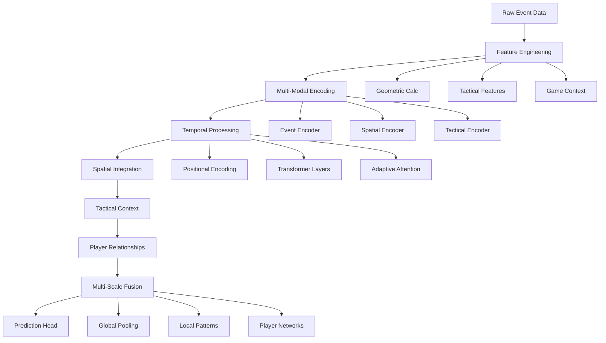

# Advanced Football Pass Prediction System: Principles & Architecture

## 🎯 **System Overview**

This system represents a sophisticated multi-modal neural architecture for predicting football pass recipients, combining temporal dynamics, spatial relationships, tactical context, and player interactions. It advances beyond simple sequence modeling to capture the complex decision-making processes in football.

## 🏛️ **Core Architectural Principles**

### 1. **Multi-Modal Intelligence**
The system integrates multiple data modalities to understand football comprehensively:

- **Temporal Sequences**: Historical pass events with sliding window attention
- **Spatial Relationships**: Geometric field positions and player movements  
- **Tactical Context**: Game state, pressure, formations, and strategic patterns
- **Player Networks**: Relationship graphs modeling passing connections

**Principle**: *Football decisions emerge from the interaction of multiple contextual factors, not just immediate event history.*

### 2. **Multi-Scale Temporal Understanding**
```
Short-term (1-4 events)  → Immediate tactical responses
Medium-term (5-12 events) → Tactical sequence patterns  
Long-term (13-24 events)  → Strategic game flow understanding
```

**Implementation**: Multi-scale positional encoding with different temporal granularities (1x, 4x, 16x scales).

**Principle**: *Pass decisions operate across multiple time horizons - immediate pressure, tactical sequences, and strategic game state.*

### 3. **Adaptive Attention Mechanisms**
- **Dynamic Head Importance**: Attention heads adapt their influence based on game context
- **Context-Sensitive Weighting**: Different situations prioritize different types of information
- **Multi-Head Specialization**: Separate attention mechanisms for events, tactics, and relationships

**Principle**: *Not all information is equally important at all times - the model should dynamically focus on relevant aspects.*

### 4. **Spatial-Tactical Integration**
```
Raw Coordinates → Geometric Features → Tactical Zones → Strategic Context
(0.2, 0.3)     → distance, angle    → defensive third → under pressure
```

**Features Engineered**:
- **Geometric**: Distance, angle, field position
- **Tactical**: Game phase, field zones, pressure indicators
- **Strategic**: Progressive passes, forward movement, difficulty

**Principle**: *Spatial information gains meaning through tactical and strategic interpretation.*

### 5. **Graph-Based Player Modeling**
- **Player Embeddings**: Dense representations of player passing behavior
- **Relationship Networks**: Graph structures capturing passing connections
- **Dynamic Adjacency**: Context-dependent player interaction strengths

**Principle**: *Football is a social game - player relationships and network effects drive passing decisions.*

## 🧠 **Neural Architecture Components**

### **1. Enhanced Event Encoder**
```python
Input: [categorical_features, numerical_features] 
       ↓
[Team, Type, Subtype, From, Phase, Zone] → Embeddings → Concat
[Coords, Geometry, Timing, Tactical] → MLP → Features
       ↓
Multi-Modal Fusion → Event Representation
```

**Purpose**: Transform raw event data into rich, multi-dimensional representations.

### **2. Multi-Scale Positional Encoding**
```python
Position → [Scale1, Scale4, Scale16] → [PE_immediate, PE_tactical, PE_strategic]
       ↓
Concatenate → Pad/Truncate → Final_PE[d_model]
```

**Purpose**: Encode temporal relationships at different granularities simultaneously.

### **3. Spatial Relationship Encoder**
```python
[Start_X, Start_Y, End_X, End_Y] → Distance + Angle + Position → Spatial_Features
```

**Purpose**: Capture geometric relationships and field positioning context.

### **4. Adaptive Multi-Head Attention**
```python
Query → Importance_Network → Head_Weights[n_heads]
Attention(Q,K,V) * Head_Weights → Context
```

**Purpose**: Dynamically weight attention heads based on situational context.

### **5. Player Relationship GNN**
```python
Player_Embeddings[from, to] → Flatten → Transform → GNN_Layers → Player_Features
```

**Purpose**: Model player interaction patterns and passing network effects.

### **6. Tactical Context Encoder**
```python
[Game_Phase, Field_Zones, Pressure] → Tactical_Embeddings → Context_Features
```

**Purpose**: Encode strategic game state and situational awareness.

## 📊 **Feature Engineering Philosophy**

### **Temporal Features (13 Total)**
| Category | Features | Purpose |
|----------|----------|---------|
| **Geometric** (4) | start_x, start_y, end_x, end_y | Raw field positions |
| **Derived** (4) | pass_length, pass_angle, event_dt, period | Calculated relationships |
| **Tactical** (5) | minute, time_pressure, pass_difficulty, forward_pass, progressive_pass | Strategic context |

### **Categorical Features (7 Total)**
| Feature | Purpose | UNK Support |
|---------|---------|-------------|
| **Team** | Team identification | No (direct lookup) |
| **Type/Subtype** | Event classification | Yes (robust handling) |
| **From/To** | Player identification | Yes (unknown players) |
| **Game_Phase/Zones** | Tactical context | Yes (missing data) |

**Principle**: *Features should progress from raw observations to tactical insights to strategic understanding.*

## 🔄 **Information Flow Architecture**



## 🎛️ **Design Patterns & Principles**

### **1. Hierarchical Feature Abstraction**
```
Raw Data → Basic Features → Tactical Features → Strategic Context
```
- Start with observable data
- Build geometric relationships  
- Add tactical interpretation
- Integrate strategic understanding

### **2. Multi-Path Processing**
```
Event_Sequence → Transformer_Path → Event_Features
Spatial_Data → Spatial_Path → Spatial_Features  
Player_Data → GNN_Path → Relationship_Features
All_Paths → Fusion → Final_Prediction
```

### **3. Attention Cascading**
```
Self_Attention → Tactical_Attention → Cross_Attention → Final_Features
```

### **4. Residual Integration**
```
Input → Transform → Output
  ↓         ↓        ↑
Skip → Gate → Residual_Add
```

**Principle**: *Complex transformations should be additive to simpler representations.*

### **5. Adaptive Complexity**
```
Simple_Context → Basic_Processing
Complex_Context → Advanced_Processing + Attention_Weighting
```

**Principle**: *Model complexity should scale with situational complexity.*

## 🔧 **Implementation Principles**

### **Tensor Shape Management**
```python
# Always explicit about dimensions
[Batch, Sequence, Features] → Clear semantic meaning
[B, S, D] → Mathematical operations
[2, 12, 256] → Concrete debugging
```

**Rule**: *Every tensor operation should have predictable, verifiable dimensions.*

### **Modular Design**
```python
EventEncoder → SpatialEncoder → TacticalEncoder → Fusion
# Each component is independently testable and replaceable
```

**Rule**: *Each component should have single responsibility and clear interfaces.*

### **Robust Error Handling**
```python
# Vocabulary management
add_unk=True for .get() operations
Direct lookup for guaranteed present values

# Dimension compatibility
Ensure even dimensions for sin/cos encoding
Proper broadcasting for multi-head operations
```

**Rule**: *Anticipate and handle edge cases at the component level.*

### **Scalable Architecture**
```python
# Configurable dimensions
d_model, n_heads, n_layers as parameters
# Multiple scales and contexts
window, context_window, temporal scales
```

**Rule**: *Architecture should adapt to different problem scales and computational resources.*

## 📈 **Performance Optimization Strategies**

### **1. Computational Efficiency**
- **Parallel Attention**: Multi-head operations parallelized
- **Batch Processing**: Efficient tensor operations
- **Memory Management**: Gradient checkpointing for large models
- **Caching**: Positional encodings pre-computed

### **2. Training Stability**
- **Layer Normalization**: Stable gradient flow
- **Residual Connections**: Prevent vanishing gradients
- **Label Smoothing**: Reduce overconfidence
- **Gradient Clipping**: Prevent exploding gradients

### **3. Generalization**
- **Dropout**: Prevent overfitting
- **Weight Decay**: L2 regularization
- **Data Augmentation**: Temporal jittering
- **Cross-Validation**: Temporal splits

## 🎯 **Key Success Principles**

### **1. Domain Knowledge Integration**
- Football tactics inform architectural choices
- Feature engineering reflects real game dynamics
- Multi-scale timing matches tactical decision horizons

### **2. Data-Driven Design**
- Features validated against domain expertise
- Architecture components tested independently
- Ablation studies to understand contribution

### **3. Robust Engineering**
- Comprehensive error handling
- Dimensional compatibility verification
- Modular, testable components

### **4. Adaptive Intelligence**
- Context-sensitive processing
- Dynamic attention allocation
- Multi-modal information integration

## 🔮 **Extensibility Framework**

### **Potential Enhancements**
1. **Real-Time Tracking Integration**: Add player velocity, acceleration
2. **Advanced Tactical Models**: Formation recognition, pressing intensity
3. **Multi-Game Learning**: Cross-match pattern recognition
4. **Opponent Modeling**: Team-specific behavioral patterns
5. **Injury/Fatigue Factors**: Physical state considerations

### **Architecture Extensions**
```python
# New encoders can be plugged in
class FormationEncoder(nn.Module): ...
class PhysicalStateEncoder(nn.Module): ...

# Fusion layer automatically adapts
fusion_input = sum(encoder.output_dim for encoder in all_encoders)
```

## 🏆 **System Philosophy**

> **"Football pass prediction requires understanding the game at multiple scales simultaneously - from immediate geometic constraints to long-term strategic patterns. The architecture should mirror this multi-scale, multi-modal complexity while remaining interpretable and robust."**

### **Core Beliefs**:
1. **Complexity Emerges from Simplicity**: Build complex understanding from simple, well-understood components
2. **Context is King**: The same action has different meanings in different contexts
3. **Relationships Matter**: Football is fundamentally about player and team interactions
4. **Time Has Structure**: Different temporal scales carry different types of information
5. **Attention is Adaptive**: Important information changes based on situation

This architecture represents a comprehensive approach to modeling the complex, multi-faceted nature of football pass prediction through principled neural network design, robust engineering practices, and deep integration of domain knowledge.